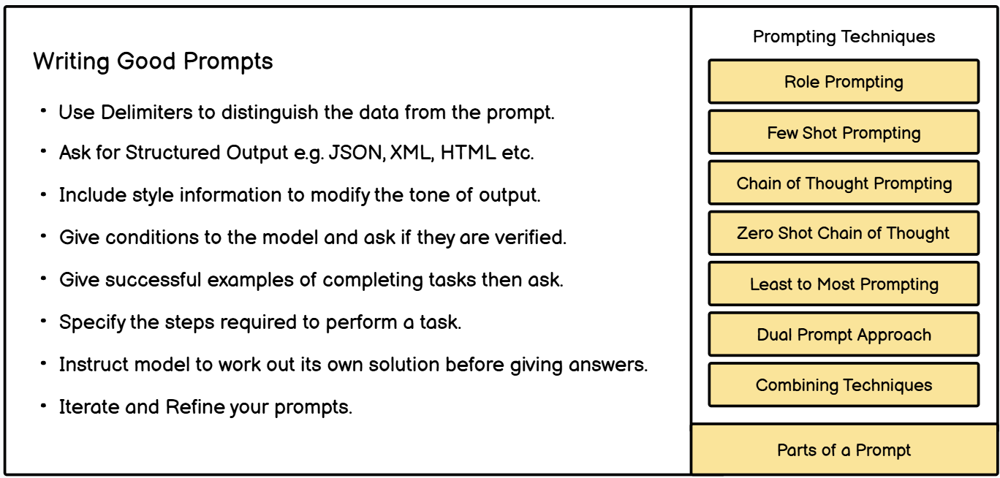

# prompt-Guide
 Prompt techniques, and their applications across various industries.

## Content

- [prompt-Guide](#awesome-llm-aiops)
  * [Content](#content)
  * [techniques](#techniques)
  * [reference](#reference)
  * [Contribution](#contribution)
    

## techniques

 - [RTF] 
Act as a[ROLE) Create a [TASK]  Show as[FORMAT]
Prompt Example: 
Facebook Ad Marketer, design a compelling Facebook ad campaign to promote a new line of fitness apparel for a sports brand. Create a storyboard outlining the sequence of ad creatives, including ad copy, visuals, and targeting strategy.

- [BAB] 
explain problem [BEFORE] state outcome [AFTER] ask to the [BRIDGE]
Prompt Example: 
We're nowhere to be seen on SEO rankings,We want to be in top 10 SEO ranking in our niche in 90 days.Develop a detailed pian for mentioning all the measures we should take also include list of top 20 keywords.

- [CARE] 
give the [CONTEXT]  describle [ACTION] clairfy the  [RESULT] give the [EXAMPLE]
Prompt Example: 
We are launching a new lino of sustainable clothing	Can you assist us in creating a targeted advertising campaign that emphasizes our environmental commitment?Our desired outcome is to drive product awarenees and sales A good example of a similar successful initiative is Patagonia's "Don't Buy This Jacket" campaign, which highlighted their commitment to commitment while enhancing their brand image

- [TAG] 
define [TASK] state the [ACTION] clairfy the [GOAL]
Prompt Example:
The task is to evaluate the performance of team members. Act as a direct manager and assess the strengths and weaknesses of team members. The goal is to improve team performance so that the average user satisfaction score moves from 6 to 7.5 in the next quarter.

- [RISE]
Specify the	[ROLE]	Describe	[INPUT]		Ask for [STEPS]		Describe the	[EXPECTATION]
Prompt Exomple:
"Imagine you are a content strategist, and you have gathered common questions related to our industry. I've gathered detailed information about our target audience, including their interests. Provide a Step by Step content strategy plan identifying key topics based on our audience insights, creating an editorial calendar, and drafting engaging content that aligns with our brand message. Aim is to increase our blog's monthly visitors by 40% and enhance our brand's position as a thought leader in our industry."

## reference
- [openai-cookbook](https://github.com/openai/openai-cookbook.git)

- [ChatGPT-Prompt](https://github.com/GoGPTAI/ChatGPT-Prompt.git)

- [Prompt-Engineering-Guide](https://github.com/dair-ai/Prompt-Engineering-Guide.git)

- [roadmap](https://roadmap.sh/prompt-engineering)

## Contributing
We welcome contributions from the community! If you'd like to contribute, please read our [Contribution Guide](CONTRIBUTION.md) for detailed instructions on how to get started.

Here’s a quick overview of how to contribute:
1. Fork the repository.
2. Create a new branch for your contribution.
3. Add your content (e.g., industry examples, code snippets, case studies).
4. Submit a pull request.

For more details, check out the [Contribution Guide](CONTRIBUTION.md).

---

## License
This project is licensed under the MIT License. See the [LICENSE](LICENSE) file for details.

### Example of Linking in `README.md`
You can link to `CONTRIBUTION.md` in multiple ways:

   Please read our [Contribution Guide](CONTRIBUTION.md) for details on how to contribute.

   ## Contributing
   We welcome contributions! Check out our [Contribution Guide](CONTRIBUTION.md) to learn how you can get involved.

   
 

